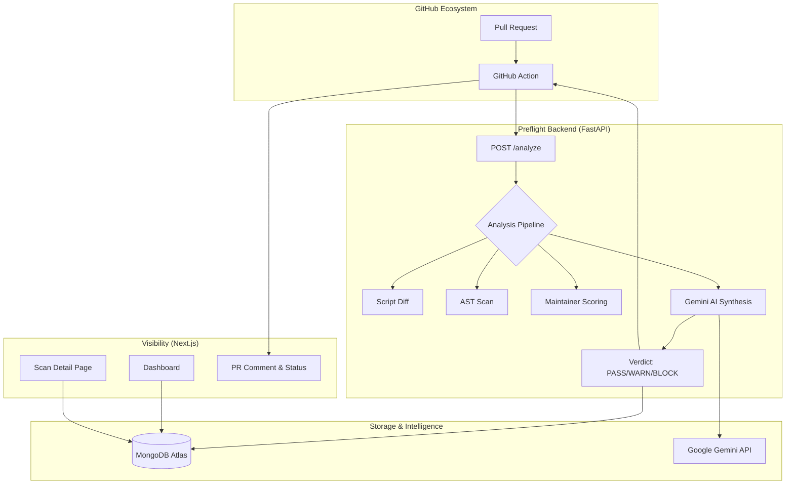
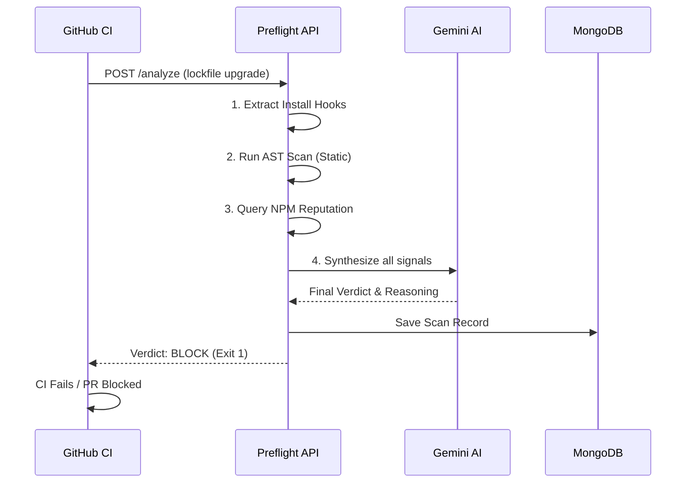

# 🛸 Preflight

**The Behavioral Pre-execution Interceptor for Supply Chain Security.**

[](https://opensource.org/licenses/MIT)
[](https://fastapi.tiangolo.com/)
[](https://nextjs.org/)
[](https://deepmind.google/technologies/gemini/)

Preflight is a modern security platform designed to detect and block novel malicious dependencies *before* they execute in your environment. Unlike traditional scanners that rely on signature databases of known CVEs, Preflight uses a multi-stage behavioral analysis pipeline powered by **Agentic AI** to identify zero-day supply chain attacks.

---

## 🏗 System Architecture

Preflight consists of three primary components working in sync to provide real-time protection and visibility.



---

## 🔄 Detection Workflow

How Preflight intercepts and analyzes a suspicious package upgrade.



---

## 🔍 The 4-Stage Analysis Pipeline

Every dependency upgrade is passed through our proprietary analysis engine to ensure maximum coverage against sophisticated threats.

| Stage | Method | Purpose |
| :--- | :--- | :--- |
| **1. Script Diff** | Tarball Analysis | Detects suspicious additions to `postinstall`, `preinstall`, and other lifecycle hooks. |
| **2. AST Scan** | Acorn Parser | Static analysis of JavaScript code to find exfiltration patterns (e.g., `process.env` access + `http.request`). |
| **3. Maintainer Risk** | NPM Metadata | Scores the publisher's history, inactivity periods, and cryptographic provenance attestations. |
| **4. Gemini AI** | Agentic Synthesis | Gemini 2.0 Flash synthesizes all signals into a human-readable verdict and attack pattern classification. |

---

## 🤖 Detection Capabilities

Preflight is designed to catch the "unseen" attacks that bypass static scanners:

*   **NPM Account Hijacks**: Detecting sudden version jumps combined with new install hooks from an inactive account.
*   **Environment Exfiltration**: Catching code that attempts to send `AWS_SECRET_ACCESS_KEY` to unknown external endpoints.
*   **Reverse Shells**: Identifying obfuscated shell-regex patterns inside legitimate-looking utility libraries.
*   **Brand-jacking**: Analyzing new dependencies for suspicious naming and low maintainer reputation.

---

## 🔌 GitHub Action Integration

Integrating Preflight into your CI/CD pipeline ensures that any new or updated dependencies in pull requests are automatically analyzed and blocked if malicious. Follow these simple steps to protect your repository:

### Step 1: Create the Workflow File
In your repository, create a new file located at `.github/workflows/preflight.yml`.

### Step 2: Add the Configuration
Copy and paste the following YAML into your newly created workflow file. This configuration triggers the scan on every pull request.

```yaml
name: Security Scan
on: [pull_request]

jobs:
  preflight:
    runs-on: ubuntu-latest
    permissions:
      pull-requests: write
      statuses: write
      contents: read
    steps:
      - uses: actions/checkout@v4
      - name: Preflight Scan
        uses: preflight-ai/preflight@v1.0.0
        with:
          lockfile: 'package-lock.json'
          fail_on_block: true # Fails CI if a critical threat is found
```

### Step 3: Customizing the Inputs
The action accepts the following inputs under the `with` key:
* **`lockfile`** (default: `package-lock.json`): The path to your lockfile. If you use Yarn or pnpm, update this path accordingly (e.g., `yarn.lock`).
* **`fail_on_block`** (default: `true`): Determines whether the CI pipeline should exit with an error (failing the build) if a malicious dependency is detected.

### How it works
Once configured, whenever a developer opens a Pull Request, the Preflight action will:
1. Parse the lockfile to detect any new or upgraded packages.
2. Send the changes to the Preflight API for behavioral analysis.
3. Automatically post a detailed comment on the PR with the analysis results and block the merge if the verdict is `BLOCK`.

---

## 📡 API Reference

### `POST /analyze`
Triggers a full security scan for a package.
- **Request Body**:
  ```json
  {
    "package_name": "axios",
    "old_version": "1.7.9",
    "new_version": "1.7.10",
    "repo": "owner/repo",
    "pr_number": 123
  }
  ```
- **Response**: Returns `verdict`, `confidence`, and detailed `signals`.

### `GET /scans`
Fetches a paginated feed of all historical scans.

### `GET /scans/{id}`
Returns full behavioral details, kill-chain timeline, and AI reasoning for a specific scan.

### `GET /packages/top-threats`
Returns the most flagged packages based on community data.

---

## 🛠 Local Development

### Prerequisites
- Node.js 20+
- Python 3.10+
- MongoDB Atlas account
- Gemini API Key

### Backend Setup
```bash
cd preflight-api
pip install -r requirements.txt
# Create .env with MONGODB_URI and GEMINI_API_KEY
python -m uvicorn app.main:app --port 8000 --reload
```

### Frontend Setup
```bash
cd preflight-web
npm install
# Create .env.local with NEXT_PUBLIC_API_URL=http://localhost:8000
npm run dev
```

---

## 🎨 Design Philosophy

The Preflight dashboard is built for **Security Operations Center (SOC)** grade visibility. It uses:
- **Glassmorphism**: A sleek, translucent UI that prioritizes information density.
- **Micro-animations**: Real-time ticker feeds and pulse indicators for live telemetry.
- **Dark Mode First**: Optimized for high-contrast monitoring environments.

---

### Checkout this repository: https://github.com/gupta-satwik/preflight-test-target.git for detailed timeline of vulnerable pull requests which were blocked by Preflight  

**Built with ❤️ for a safer open-source ecosystem.**
